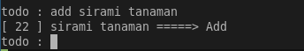
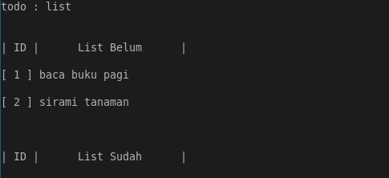
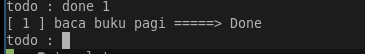
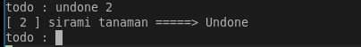
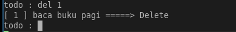
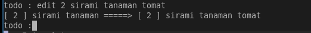

# ToDo List Python

ToDo List Python adalah sebuah program sederhana yang berjalan bahasa python, sangat mudah untuk dijalankan dan digunakan. Program yang membantu melakukan tugas tugas sederhana seperti menyimpan kegiatan, acara, kebiasaan.

**Halaman**
- Panduan Penggunaan
  - Command
    - Add
    - List
    - Done
    - Undone
    - Delete
    - Edit
    - Exit
- Kerja Program
  - Workflows
  - Block Code
- Rancangan Fitur Selanjutnya
- dan Umpan Balik

## Panduan Penggunaan

Beberapa command yang tersedia :

- Add
- List
- Done
- Undone
- Delete
- Edit
- Exit

### Command

#### Add

**Menambahkan** sebuah **Tugas** pada list
*Format Perintah :*
```bash
add [Tugas]
```
*Contoh Penggunaan Perintah :*
```bash
add sirami tanaman
```
*Dokumentasi :*

---
#### List

**Melihat** isi list **Tugas**
*Format Perintah :*
```bash
list
```
*Contoh Penggunaan Perintah :*
```bash
list
```
*Dokumentasi :*

---
#### Done

**Menyelesaikan** sebuah **Tugas** pada list
*Format Perintah :*
```bash
done [ID Tugas]
```
*Contoh Penggunaan Perintah :*
```bash
done 1
```
*Dokumentasi :*

---
#### Undone

**Tidak Menyelesaikan** sebuah **Tugas** pada list
*Format Perintah :*
```bash
undone [ID Tugas]
```
*Contoh Penggunaan Perintah :*
```bash
undone 1
```
*Dokumentasi :*

---
#### Delete

**Menghapus** sebuah **Tugas** pada list
*Format Perintah :*
```bash
del [ID Tugas]
```
*Contoh Penggunaan Perintah :*
```bash
del 1
```
*Dokumentasi :*

---
#### Edit

**Mengubah** **Tugas Lama** ke **Tugas Baru** pada list
*Format Perintah :*
```bash
edit [ID Tugas] [Tugas Baru]
```
*Contoh Penggunaan Perintah :*
```bash
edit 1 sirami tanaman tomat
```
*Dokumentasi :*

---
#### Exit

**Keluar** dari **Program**
*Format Perintah :*
```bash
exit
```
*Contoh Penggunaan Perintah :*
```bash
exit
```
*Dokumentasi :*

---
